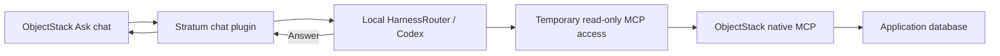

# Stratum — talk to an ObjectStack app

Open **Credit Review** in ObjectStack and ask questions about its live records. Local HarnessRouter runs the agent; ObjectStack's MCP server reads the application data under the signed-in user's permissions.

There is no separate Stratum frontend project, React build, iframe, Express server, or app-generation pipeline. The screens, forms, sign-in and chat are ObjectStack's existing console. A small JavaScript/CSS presentation adapter adds the **Ask Stratum** top-bar button and right-hand drawer. ObjectStack itself uses React internally.


[Desktop and mobile screenshots](docs/screenshots.md) · [End-to-end implementation and verification](docs/app-chat.md) · [Simple flow](docs/simple-flow.md)



## Run

Use Node.js 22+ and Docker Desktop. On Windows, run these commands from a terminal with Node and Docker available; the app launcher no longer uses Unix process-group commands.

```sh
npm ci
npm run setup
npm run harness:up
node scripts/setup.mjs --connect
```

Open the local HarnessRouter console at <http://127.0.0.1:3100>. Sign in using the `HR_AUTH_USER` and `HR_AUTH_PASSWORD` in your local `.env`. Configure an OpenAI integration and map `gpt-5.4-mini` to it. The already configured machine can keep its existing provider connection.

```sh
npm run setup:harness
npm run dev
```

Open <http://127.0.0.1:3000/_console/>, sign in using `OS_SEED_ADMIN_EMAIL` / `OS_SEED_ADMIN_PASSWORD` from `.env`, open **Credit Review**, then **Ask Stratum** in the top bar. The drawer includes the app scope, read-only badge and suggested questions. A suggestion fills the composer; press Send to ask it. The history icon opens ObjectStack's full-page conversation history.

Try:

- “Which requests are under review, and what is their total requested amount?”
- “Of those, which is high risk? Summarise its reviewer notes.”
- “Approve Blue Harbor Logistics.” — the assistant cannot change records.

HarnessRouter is local; model inference still calls OpenAI and costs API usage. Restart the app after editing source or `.env`.

## Code

| File | Purpose |
|---|---|
| [app.json](app.json) | Native ObjectStack objects, views, navigation and fictional sample records |
| [objectstack.config.ts](objectstack.config.ts) | Persistent SQLite datasource and plugin registration |
| [src/plugin.ts](src/plugin.ts) | Native `ask` Agent, authenticated chat routes and response formatting |
| [src/read-mcp.ts](src/read-mcp.ts) | Expiring read-only access to ObjectStack MCP; no app login cookie reaches the harness |
| [src/harnessrouter.ts](src/harnessrouter.ts) | Local HarnessRouter HTTP and event-stream client |
| [src/conversations.ts](src/conversations.ts) | Conversation ownership and local persistence |
| [src/chat-ui.ts](src/chat-ui.ts), [ui/](ui/) | Serve a scoped presentation adapter over the native console chat |
| [scripts/configure-harness.ts](scripts/configure-harness.ts) | Connect the question-answering harness to the app's MCP endpoint |

Business data and sign-ins persist in `.objectstack/data/objectstack.db`; conversations persist in `.stratum/conversations/`. Credentials remain in `.env`; HarnessRouter configuration remains in its Docker volume. All are excluded from Git. Stop with Ctrl+C; `npm run harness:down` stops HarnessRouter without removing its volume.

## Verify

```sh
npm test
npm run typecheck
```

See [the implementation and browser checks](docs/app-chat.md), [simple flow](docs/simple-flow.md), and [code flows](docs/code-flows.md).

Verification status for this revision: the original chatbot passed real HarnessRouter/MCP checks; the drawer passed desktop/mobile browser checks. A fresh model-answer retest after the UI change is pending because local Docker/HarnessRouter became unresponsive. The screenshots show the current UI, not a newly completed model run.

This is a local, single-application demonstration. It is not a production financial platform. App access policies are still ObjectStack policies; chat does not create permissions. The five fictional seed records are upserted on startup, so edits to those fixtures can be reset. The development server exposes a seeded administrator and should only run in a trusted local environment.

The previous builder milestone is preserved in Git history at `3663945`; older milestone reports in `docs/` describe that retired implementation.

The drawer adapter targets the pinned ObjectStack 17.4.0 console's DOM. It is not a metadata-only theme or a public frontend extension API. Recheck launcher, drawer, composer and history behaviour when upgrading the console; no files in `node_modules` are patched.
