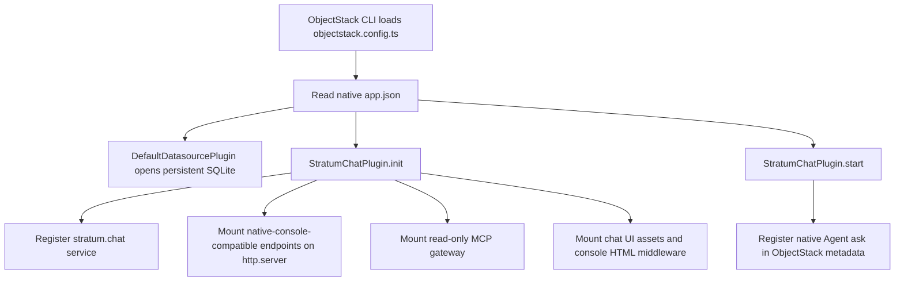
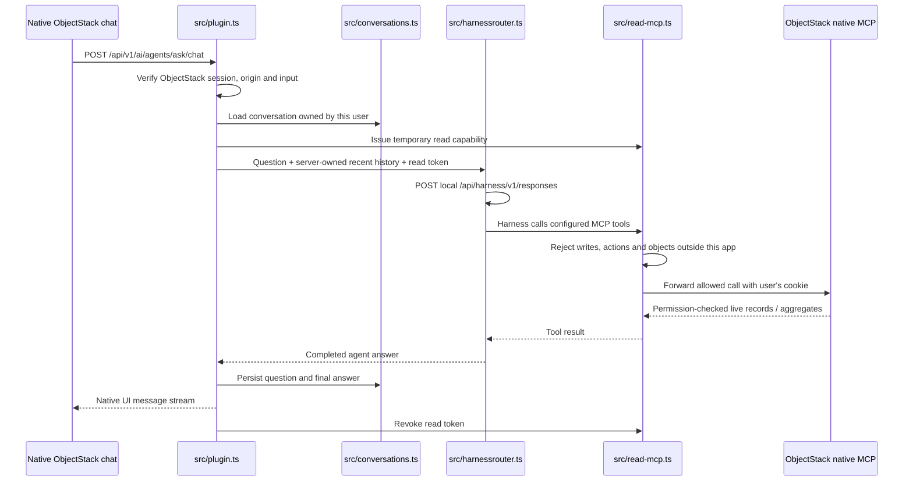
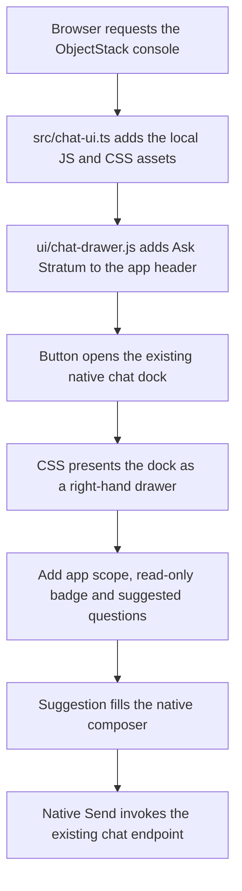
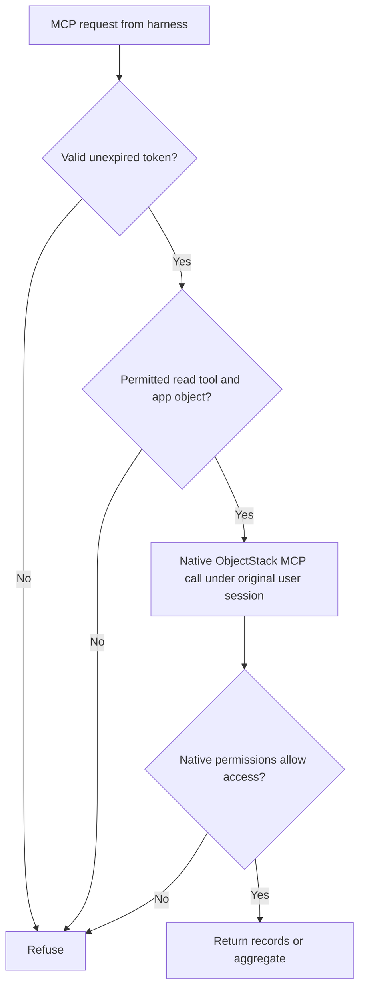

# Code flows: in-app questions

## Registration

## A question

The chat adapter uses ObjectStack's public HTTP-server service. There is no independent web server or frontend build. `src/chat-ui.ts` adds the small `ui/chat-drawer.js` and CSS presentation adapter to the stock console; native chat continues to own conversations, the composer and transport. HarnessRouter uses a fresh sandbox per turn, with recent conversation text supplied by the server. This avoids carrying credentials from a previous turn's workspace forward.

## Drawer presentation

This adapter targets the pinned console DOM. It uses the server's public HTTP service, but the browser selectors are not a public frontend extension contract. Revalidate the presentation after a console upgrade. [Screenshots](screenshots.md) show the current desktop and mobile result.

## Read boundary

The harness sees `list_objects`, `describe_object`, `query_records`, `get_record` and `aggregate_records`. It does not receive the login cookie or a write-capable app API key. The native MCP endpoint still serves the framework's broader capabilities to independently authorised clients; this assistant receives only the restricted gateway credential.
