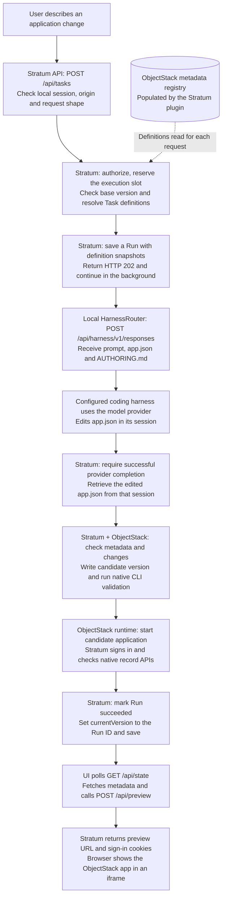
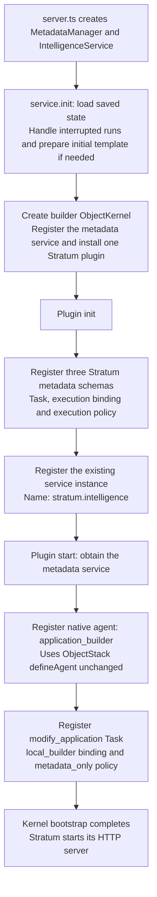
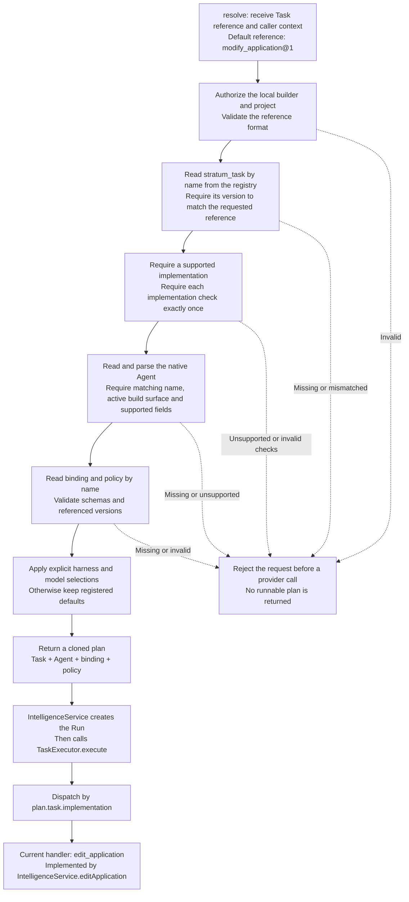
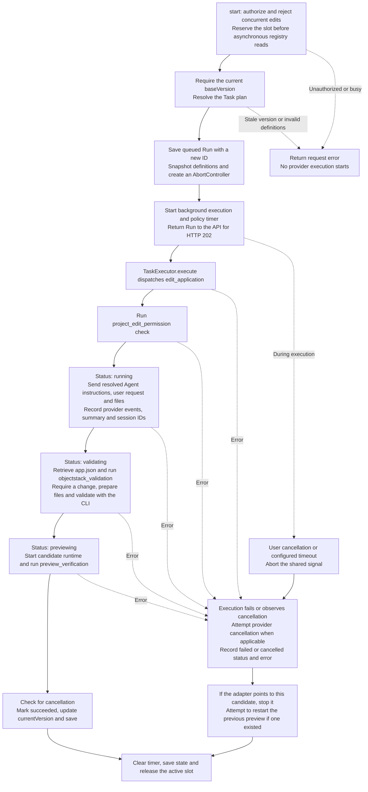
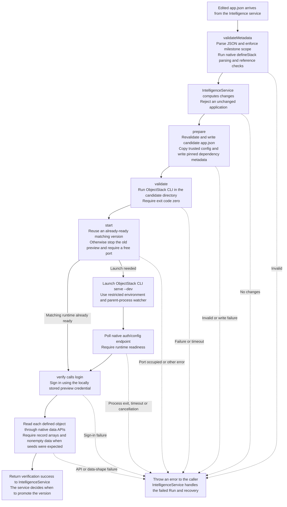

# Stratum milestone: code flows

This guide follows the current implementation. It connects the Stratum document's Agent and Task concepts to the working application-building loop. The Mermaid diagrams render directly on GitHub.

An example request throughout is: **“Change Reviewer notes to Review notes, keeping everything else unchanged.”** The coding harness edits the native ObjectStack `app.json`; Stratum checks the result and runs it as a candidate application version.

## The concepts used here

| Concept | Meaning in this code |
| --- | --- |
| ObjectStack metadata | Structured definitions of objects, fields, views, navigation and sample data in `app.json`. |
| ObjectStack runtime | The separate process that turns those definitions into the working application, forms and record APIs. |
| Plugin | One Stratum module that registers metadata types, definitions and an execution service in the builder's ObjectStack kernel. |
| Metadata registry | ObjectStack's catalogue of named definitions. The executor reads it through an in-process library call. |
| Agent | ObjectStack's native definition of the builder's identity, role and instructions. |
| Task | Stratum's definition of an operation, linking an Agent, implementation, execution binding, policy and required checks. |
| Execution binding / policy | The binding selects local HarnessRouter, a harness and an optional model. The policy supplies the timeout. |
| Run | One execution attempt, with configuration snapshots, progress, checks, changes and an outcome. |

ObjectStack has **two roles**: its kernel and metadata registry support the Stratum builder, while a separate ObjectStack runtime runs the generated application. Stratum's prompt UI and HTTP API are our own code. Registering a native Agent supplies a definition; Stratum's execution service connects that definition to HarnessRouter.

## 1. Overall request flow

Sources: [browser UI](../public/app.js), [HTTP server](../src/server.ts), [Intelligence service](../src/intelligence.ts), [HarnessRouter client](../src/harnessrouter.ts), [ObjectStack adapter](../src/objectstack.ts).

The UI polls Stratum while execution is in progress, so Activity and status updates appear before completion. The chart follows the successful path; the service diagram below shows failure and cancellation.

| Interface | Owner and purpose |
| --- | --- |
| Port 3000: `/api/tasks`, `/api/state`, `/api/metadata`, `/api/registry`, `/api/preview` | Stratum's APIs for building, observing and opening applications. |
| Port 3100: `/api/harness/v1/responses` and session/file endpoints | Local HarnessRouter's APIs for invoking a harness and retrieving its output. |
| Port 3002: `/api/v1/auth/...`, `/api/v1/data/:object` and `/_console/` | The generated application's ObjectStack runtime. |

Once the application is running, ordinary record creation and editing go through ObjectStack's record APIs. They do not invoke HarnessRouter. Local HarnessRouter still calls the configured external model provider for generation.

## 2. Plugin flow: register the building blocks at startup

Source: [src/plugin.ts](../src/plugin.ts), installed by [src/server.ts](../src/server.ts).

The plugin runs during startup. It does not execute a model request when it registers the Agent.

| Registered kind | Default name | What it contributes |
| --- | --- | --- |
| Native `agent` | `application_builder` | Builder role, instructions and build surface. |
| `stratum_task` | `modify_application` | Version `1`, Agent reference, `edit_application` handler and required checks. |
| `stratum_execution_binding` | `local_builder` | Version `1`, local provider, harness ID and optional model. |
| `stratum_execution_policy` | `metadata_only` | Version `1` and a 600,000 ms timeout. |

There is one plugin, `com.stratum.intelligence`. The `stratum_*` entries above are metadata types, not separate plugins. There is no custom `stratum_agent` type and no replacement of ObjectStack's Agent schema.

## 3. Task flow: resolve configuration, then dispatch work

Source: [src/tasks.ts](../src/tasks.ts), called by [src/intelligence.ts](../src/intelligence.ts).

`resolve()` determines **what configuration this invocation will use**. `execute()` dispatches to the implementation; it does not itself contain the application-editing logic.

The registry uses names as keys. A reference such as `modify_application@1` means “load `modify_application`, then verify version `1`.” This currently supports one registered definition per name, not multiple simultaneously addressable releases. The native Agent has no extra Stratum version field; its definition is captured in the Run snapshot.

The three required checks are `project_edit_permission`, `objectstack_validation` and `preview_verification`. They are fixed supported checks, not arbitrary executable hooks. Unsupported native Agent settings are rejected rather than silently treated as implemented.

## 4. Intelligence flow: manage one execution from request to result

Source: [src/intelligence.ts](../src/intelligence.ts).

The permission check runs before generation. Metadata validation runs after generation. Preview verification runs after the candidate runtime starts. A passed check is recorded with its name and timestamp.

User cancellation produces `cancelled`; a policy timeout produces `failed`. Before promotion, a failed candidate does not replace the accepted version. Restarting the previous preview is **best effort**: the adapter may have already stopped the old process, and recovery can also fail. This is not a guarantee of uninterrupted preview availability.

State is written through a temporary file and renamed to `.stratum/state.json`. On restart, incomplete historical runs are marked failed and provider cancellation is attempted when a response ID is available. They are not automatically resumed. This is local file-backed execution, not a durable distributed job queue.

## 5. ObjectStack adapter flow: turn edited metadata into a checked preview

Source: [src/objectstack.ts](../src/objectstack.ts). Its caller controls the sequence; this file exposes the individual operations.

| Operation | What the current implementation actually checks or does |
| --- | --- |
| `validateMetadata()` | Allows the milestone's native metadata sections and field types; checks project identity and namespace; rejects executable/custom metadata; uses native `defineStack`; checks navigation and seed references; requires stable seed upsert keys. |
| `prepare()` | Creates `.stratum/versions/<run-id>/` containing `app.json`, the trusted `objectstack.config.ts` and dependency metadata. |
| `validate()` | Runs the native CLI validation command with a 90-second timeout. |
| `start()` | Manages the preview process and checks its readiness endpoint. |
| `verify()` | Checks sign-in, object API responses, record-array shape and basic sample-data presence. It does not verify every requested business behaviour or every sample record. |
| `stop()` | Attempts graceful process-group shutdown, then forceful shutdown if needed. The current process handling assumes Unix semantics; native Windows portability work remains. |

The browser's later `POST /api/preview` request calls `start()`, `verify()` and `login()` again, reusing the ready runtime when possible and returning the sign-in cookies and preview URL. This is how the application becomes usable inside the Stratum iframe.

## What these flows prove, and what remains

The implemented loop connects a native Agent definition and Stratum Task to local HarnessRouter, accepts native ObjectStack metadata, checks it and opens a working application preview. No ObjectStack source modification or separate Stratum application format is involved.

The current boundaries remain: one fixed local builder/project context; one editing implementation; no Task invocation from native application workflows; no tenant permission propagation or approval/release governance. Each application version has its own preview database, so business records are not migrated between versions. Native Agent registration does not automatically add those missing execution or governance capabilities.

For implementation history and verification evidence, see [the native Agent refactor](native-agent-refactor.md) and [milestone notes](milestone-1.md).
