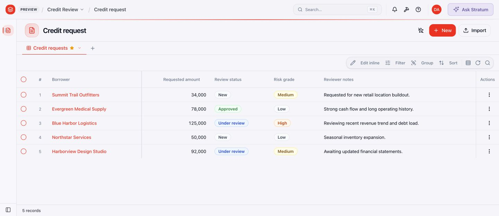
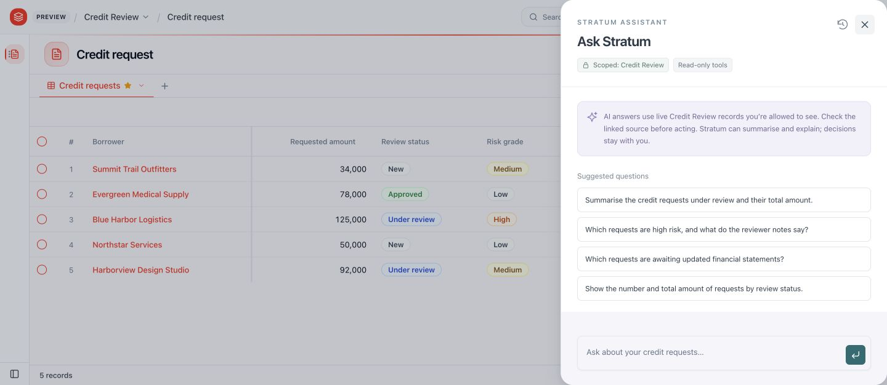
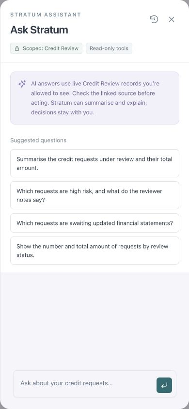

# In-app chat screenshots

Captured through the connected Chrome extension on 24 September 2026. These are screenshots of the actual ObjectStack application with fictional Credit Review records. The desktop viewport was 1440 × 626; the mobile verification viewport was 390 × 844 and was reset after capture.

## Top-bar launcher

The **Ask Stratum** button opens the assistant without leaving the application.

## Right-hand drawer

The drawer shows the server-enforced application scope, read-only tool badge, information box and relevant suggested questions. Clicking a suggestion fills the native composer; Send submits it. The history icon opens ObjectStack's existing conversation screen.

## Mobile drawer

At phone width, the assistant fills the screen and keeps the composer accessible. The app header uses an icon button with the accessible name “Ask Stratum”.

## Verification context

These captures document the presentation change. Desktop/mobile layouts, opening and closing, Escape, suggestion prefilling, history navigation and existing-message rendering were checked in Chrome. The original chatbot's live HarnessRouter/MCP tests passed earlier; a fresh model-answer retest after the drawer change is pending because local Docker/HarnessRouter became unresponsive. See [the detailed verification record](app-chat.md).

The `v1-*.png` files in `docs/screenshots/` belong to the retired builder milestone and are retained as historical evidence.
