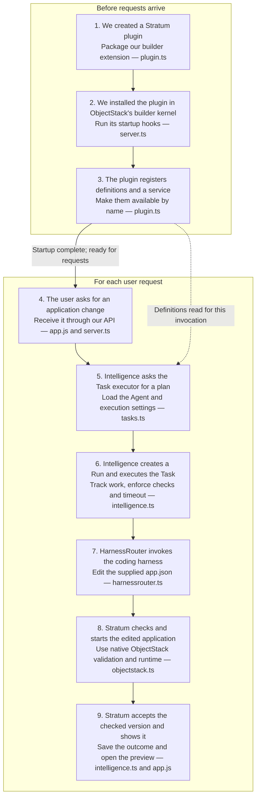

# How we connected Stratum, ObjectStack and HarnessRouter

We built a Stratum extension that describes the application builder, connects a user request to its execution settings, asks a coding harness to edit the application, and checks the resulting ObjectStack preview.

Read the flow from top to bottom. The first three steps establish the building blocks before requests arrive. The remaining steps happen for each request.

## What each step means, and where it lives

| Step: what we did or what happens | Concept and reason | Related code |
| --- | --- | --- |
| **1. Created `StratumIntelligencePlugin`.** We put the native Agent, our Task, execution settings and registration logic in one extension. | **Plugin:** ObjectStack's way to add platform capabilities. It gives our builder definitions and service one place to join the platform lifecycle. | [plugin.ts](../src/plugin.ts): `StratumIntelligencePlugin`, `builderAgent`, `builderTask`. |
| **2. Installed that plugin in the builder host.** The server creates the metadata manager, Intelligence service and ObjectStack kernel, then calls `kernel.use(...)` and `kernel.bootstrap()`. | **Kernel and plugin lifecycle:** writing a plugin class alone does not activate it. Installing it lets ObjectStack run its initialization and startup hooks. | [server.ts](../src/server.ts): server startup. |
| **3. Registered the schemas, definitions and service.** `init()` registers our three custom metadata schemas and the existing Intelligence service. `start()` stores the native Agent, Task, binding and policy in the metadata registry. | **Registry:** a catalogue of named definitions. It lets execution read the configured Agent and settings for each request. The Agent uses ObjectStack's existing schema. | [plugin.ts](../src/plugin.ts): `init()` and `start()`. |
| **4. Accepted a user request.** The browser sends the prompt and current application version to `POST /api/tasks`. Our server checks the request and calls `service.start(...)`. | **Stratum API:** the entry point from the prompt UI. The default Task is `modify_application@1`. This is an API we wrote. | [app.js](../public/app.js): prompt submission; [server.ts](../src/server.ts): task route. |
| **5. Resolved the Task into an execution plan.** Intelligence checks access, prevents overlapping edits and checks the base version. It then asks the Task executor to load and validate the Task's references. | **Task + Agent + binding + policy:** the Task identifies the operation; the Agent supplies role and instructions; the binding selects the harness/model; the policy supplies the timeout. | [intelligence.ts](../src/intelligence.ts): `start()`; [tasks.ts](../src/tasks.ts): `TaskExecutor.resolve()`. |
| **6. Created a Run and started execution.** Intelligence saves a new Run with snapshots of those definitions. It starts background execution, and the Task executor dispatches to `editApplication()`. | **Run and execution service:** the Task is reusable; the Run records this particular attempt. Intelligence coordinates status, events, cancellation, timeout and required checks. The API returns HTTP 202 while work continues. | [intelligence.ts](../src/intelligence.ts): `start()`, `execute()`, `editApplication()`; [tasks.ts](../src/tasks.ts): `execute()`. |
| **7. Asked the coding harness to edit the application.** Intelligence supplies the Agent's instructions, user request, current `app.json` and `AUTHORING.md`. Our client sends them to local HarnessRouter, reads events and retrieves the edited file. | **Harness integration:** HarnessRouter invokes the configured coding harness, which uses the model provider to carry out the edit. | [intelligence.ts](../src/intelligence.ts): `editApplication()`; [harnessrouter.ts](../src/harnessrouter.ts): `run()` and `appFile()`. |
| **8. Checked and ran the candidate application.** Stratum checks the metadata and requires an actual change. It writes candidate files, invokes ObjectStack validation, starts its runtime, signs in and checks the object APIs. | **Native application metadata and runtime:** ObjectStack turns the edited definitions into a working application. Stratum checks the output before accepting it. | [objectstack.ts](../src/objectstack.ts): `validateMetadata()`, `prepare()`, `validate()`, `start()` and `verify()`. |
| **9. Accepted the result and displayed it.** After the checks pass, Intelligence marks the Run successful and updates the current version. The UI observes the result, requests a signed-in preview and displays the application. | **Application version and preview:** an accepted change becomes the new current version; the user can inspect its Changes, Activity and running application. | [intelligence.ts](../src/intelligence.ts): end of `editApplication()`; [app.js](../public/app.js): `refresh()` and `preview()`; [server.ts](../src/server.ts): preview route. |

## Follow one example

The user asks: **“Change Reviewer notes to Review notes.”** The API uses the existing `modify_application` Task. That Task points to the native `application_builder` Agent and the configured local harness. Intelligence records a new Run, and the harness edits the field label in `app.json`. Stratum validates the changed definition, checks the ObjectStack runtime, then displays the accepted version.

The request creates a **new Run**, not a new plugin or Agent definition. The plugin is installed once per server startup, and the existing definitions are read for each invocation.

The plugin registers `stratum.intelligence`, but the current HTTP server calls that same service instance directly. ObjectStack does not automatically implement or dispatch our `/api/tasks` endpoint. Likewise, registering the native Agent does not itself execute the harness; our Intelligence service and HarnessRouter client supply that connection.

This diagram shows the successful building loop. The [detailed flowcharts](code-flows.md) cover rejection, cancellation, failure and best-effort preview recovery. Workflow invocation, real tenant permissions and governed releases remain outside this milestone.
