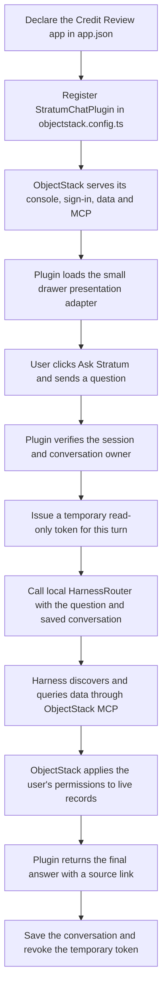

# Simple flow: talking to the app

We created `com.stratum.app-chat` because ObjectStack provides the app UI and MCP data tools, while local HarnessRouter needs an adapter to power the existing chat. Registering it in `objectstack.config.ts` puts that adapter inside the app's runtime.

The native Agent is `ask`, defined with `defineAgent`. It describes the assistant's role and instructions. `StratumChatPlugin` supplies the execution integration. `ReadOnlyMcp` permits only the five read tools and forwards them to native `/api/v1/mcp` with the authenticated caller's cookie, kept server-side.

For the UI, the same plugin calls `mountChatUi` in `src/chat-ui.ts`. It serves `ui/chat-drawer.js` and `ui/chat-drawer.css` through ObjectStack's HTTP server. These add the top-bar button and decorate the existing native chat as a drawer. They reuse its composer, messages and history; they do not create another chat backend. See [screenshots](screenshots.md).

A question is a conversation turn. The previous builder's custom Task/binding/policy registry, file editing, version promotion and preview management have been removed. This milestone does not claim to implement the broader Stratum Task system.
